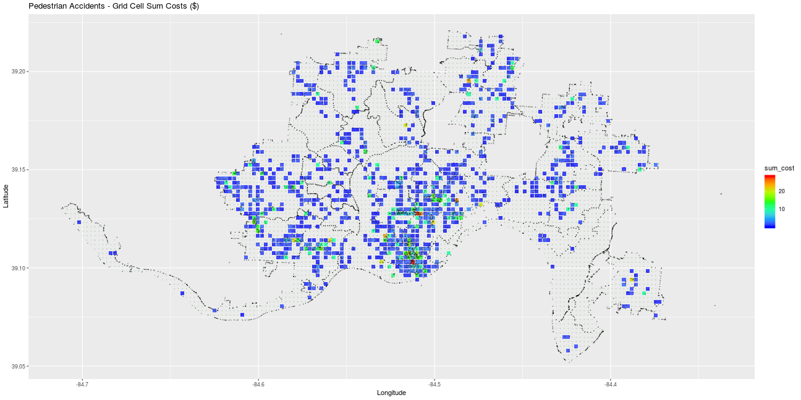

# CapstoneProject

1. ~~write routine to assign a geo-coordinate to its approrpriate grid cell~~
	- each grid cell is defined by 4 corner points (geo-coordinates)
	- any data value (e.g., survey response) has its own geo-coordinate
	- what grid cell does it belong to ?
	- routine needs to be flexible in case we re-define grid pattern
	- grid cells are not exactly square, since they are mapped in coordinate system associated to curvature of earth~~

2. review each of the data sets from Cincy Open Data and explore the categorical columns
	- how many different factors are in each category ?
	- is it useful for our purposes ?
	- evaluate if some factors can be grouped together for more logical features
		* e.g., in 311 non-emergency data set, there is a column $service_code, there are > 600 unique values in this column. can these be grouped into 10 or 20 categories, or is this just non useful for our purposes ?

3. ~~write routine to assign a geo-coordinate to its appropriate Cincy neighborhood~~
	- neighborhoods are defined in shape file  :
		* _CapstoneProject/data/ZillowNeighborhoods-OH/ZillowNeighborhoods-OH.shp_
	- similar idea to to-do item 1, except irregular shaped polygon instead of grid cell~~

4. text processing : we have a lof text fields. should we start writing code to categorize these texts, either by sentiment analysis, bag-of-words, or word2vec approaches ?
	- which data fields from which data sets ?
	- what approaches ?

5. feature development. need to go thru each data set, column by column and decide what features we should develop :
	- one-hot-encode categorical features
	- outlier removal on continuous valued columns
	- aggregation / counts / other ideas ?
	- __count number of occurrences of event type that occur in grid cell__
	- do the full monty of multiply / add / subtract / divide between each pair of data values, à là the method demonstrated during last week's cap b seminar (fantasy football guy) ??
	- keep running log of what we are doing, so we can revise, edit not duplicate

6. just make a bunch of plots to characterize each data set, so we have runnning reference of what each data set looks like
	- archive them in a new sub-folder on github : eda_plots

7. decide what we are gonna do about twitte

8. decide what we are gonne do about strava.
	- is there a back-up solution for pedestrian / bicycling movement patterns ?

9. map geo-coordiantes for bus routes 

...

98. make powerpoint charts for Nov 2 presentation
99. design layout and make poster for Nov 2 poster session
100. finish editing paper
101. critique assigned papers
102. graduate 

Notes :

- I have been using R for the most part. probably does not matter what we use (R, python, mis between the two) as long as we do decent job to comment the code and try to keep it generically functional
-  Preeti, Joshua, and Patrick rock. no bullshit
